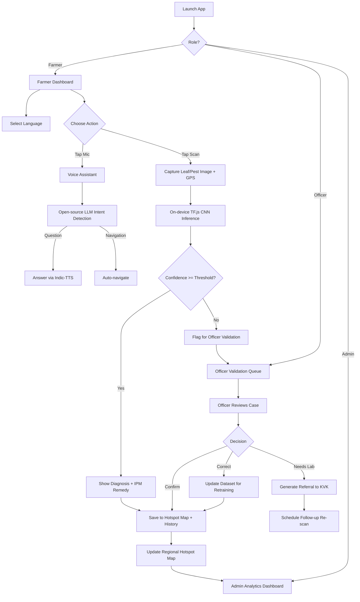

# Product Requirements Document (PRD)
**Project Name:** Krushi Sarathi
**SIH Problem Statement ID:** 26131
**PS Title:** Early Detection and Management of Crop Diseases and Pest Infestations
**Document Version:** v2.0 (SIH Edition)
**Status:** Draft for Development

---

## 1. Problem Statement Alignment

| SIH PS Requirement | Krushi Sarathi Response |
|---|---|
| Image-based symptom identification | Crop Disease Scanner (CV model) |
| Pest-trap / sensor inputs | IoT Telemetry Module (mock → real hardware later) |
| Weather-based risk forecasting | AI Weather Risk Engine |
| Geospatial hotspot mapping | Hotspot Map (farmer + external data) |
| Expert validation | Officer/Agronomist Validation Dashboard |
| Multilingual advisories | 11-language interface + voice |
| IPM & safe input usage recommendations | Remedy Engine with dosage/safety guardrails |
| Referral to extension/labs | Escalation & Referral flow |
| Follow-up monitoring | Case tracking + re-scan reminders |
| Learn from field confirmations | Feedback loop → model retraining dataset |
| Dashboards for agriculture officials | Officer & Admin Dashboards |

**Core positioning for judges:** Krushi Sarathi is not just a disease-scanner app — it is a **closed-loop crop health surveillance system**: Farmer reports → AI detects → Officer validates → Data feeds hotspot map & retraining → System gets smarter → Next farmer gets better, faster advice.

---

## 2. Product Overview

Krushi Sarathi is a multilingual, voice-first, vision-enabled crop health platform for Indian farmers, extension workers, and agriculture officials. It combines on-device/edge AI disease detection, weather-driven risk forecasting, crowd + government geospatial hotspot intelligence, and a human-in-the-loop expert validation system — built entirely on **free and open-source technologies** so it is cost-free to run at scale (critical for a government/SIH deployment).

---

## 3. User Roles

1. **Farmer** (Primary) — scans crops, gets advisories, views local risk, voice interaction.
2. **Extension Officer / Agronomist** (New) — validates AI diagnoses, manages cases in their jurisdiction, pushes bulletins.
3. **Admin / Agriculture Official** (New) — views regional dashboards, hotspot analytics, surveillance coverage, exports reports.

---

## 4. Feature Set (Target State)

### 4.1 Multilingual Interface (11 Languages) — *Existing, retained*
Gujarati, Hindi, Marathi, Punjabi, Tamil, Telugu, Bengali, Kannada, Malayalam, Odia, English.
- **Upgrade:** Replace ad-hoc translation with **AI4Bharat IndicTrans2** (open-source, purpose-built for Indian languages) for advisory text translation, run via self-hosted HuggingFace inference (free).

### 4.2 AI Voice Assistant — *Upgraded*
- Speech-to-Text: Browser-native `webkitSpeechRecognition` (free) as primary; fallback to self-hosted **Whisper (faster-whisper, small/base model)** for low-connectivity/regional-accent accuracy.
- Intent Detection & Chat: Replace Gemini with an **open-source LLM** served free via:
  - **Groq API free tier** (Llama 3.1 8B / Mixtral) — fastest, zero cost, generous rate limits, OR
  - **Self-hosted Ollama + Llama 3.1 8B / Mistral 7B** for a fully offline-capable, zero-external-dependency demo (ideal for SIH judging in low-internet venues).
- Text-to-Speech: Browser-native `speechSynthesis`; fallback to **AI4Bharat Indic-TTS** (open-source, trained specifically on Indian language phonetics) for better regional pronunciation.

### 4.3 Crop Disease & Pest Scanner (Computer Vision) — *Core Upgrade*
- Replace Gemini 1.5 Flash Vision with an **open-source CNN model**:
  - Base: **MobileNetV2 / EfficientNet-Lite**, fine-tuned on **PlantVillage + PlantDoc** open datasets (38+ disease classes across 14 crops).
  - Deployment: Export to **TensorFlow.js** and run **inference directly in-browser** (client-side) — zero server cost, works offline once loaded, instant results, huge plus point for judges ("edge AI").
  - Fallback for rare/unclear cases: self-hosted model via **HuggingFace Inference Endpoints (free tier)** or a lightweight FastAPI + ONNX Runtime server.
- Output: disease name, confidence score, severity estimate, and **IPM-based remedy** (organic-first, then chemical, with correct dosage & safety notes) in the user's language.
- If confidence < threshold (e.g., 70%) → auto-flag for **Officer Validation** (see 4.6).

### 4.4 Pest-Trap / IoT Sensor Inputs — *New/Upgraded*
- Phase 1 (SIH demo): Mocked data with realistic simulation logic (soil moisture curves, pest trap counts correlated with weather).
- Future scope: Open-hardware **ESP32 + soil/humidity sensors + pest-trap camera**, MQTT protocol, ingested via free-tier **Supabase Realtime** or self-hosted **Mosquitto broker**.

### 4.5 AI Weather Risk Forecasting — *Existing, retained + enhanced*
- **Open-Meteo API** (free, no key required) for hyperlocal humidity, temperature, rainfall.
- Risk model: rule-based/statistical engine mapping (crop stage × weather × historical local outbreak data) → pest/disease outbreak probability (Low/Medium/High), extendable to a lightweight open-source ML model (e.g., scikit-learn Random Forest) trained on ICAR/agromet advisory data.

### 4.6 Expert Validation Dashboard — *New (PS-critical)*
- Every AI diagnosis is logged as a **Case**.
- Low-confidence or farmer-disputed cases route to the nearest **Extension Officer's queue**.
- Officer reviews image + AI prediction → **Confirms / Corrects / Requests lab test**.
- Confirmed cases feed back into a **retraining dataset** (active learning loop) and update the **regional hotspot map** in real time.
- Officer can push a **bulletin/alert** to all farmers in an affected zone.

### 4.7 Geospatial Hotspot Mapping — *New*
- Map built with **Leaflet.js + OpenStreetMap tiles** (fully free, no Google Maps billing).
- Data sources (as chosen):
  1. **Farmer-reported scans** — GPS-tagged at capture time (with consent).
  2. **External/government data** — integrate **data.gov.in** open APIs (ICAR/Krishi Vigyan Kendra pest surveillance datasets where available) as a background layer.
- Visualizes disease/pest density clusters by district/taluka, filterable by crop, disease type, and time window.

### 4.8 Referral & Follow-up Monitoring — *New*
- If officer marks a case as "needs lab confirmation" → auto-generates referral slip with nearest **Krishi Vigyan Kendra (KVK)** / soil-testing lab contact (static directory, seeded from public govt data).
- System schedules a **follow-up re-scan reminder** (push/voice notification) 7–10 days later to track treatment efficacy — this closes the monitoring loop the PS explicitly asks for.

### 4.9 Farmer Dashboard — *Existing, retained*
- AI Weather Risk, Local History, now also shows **regional hotspot alerts** and **officer bulletins**.

### 4.10 Officer & Admin Dashboards — *New*
- **Officer:** case validation queue, jurisdiction map, bulletin composer.
- **Admin:** state/district-level surveillance coverage %, outbreak trends over time, model accuracy stats, exportable CSV/PDF reports for government reporting.

### 4.11 Authentication & Profile — *Existing, retained*
- Phone-based OTP login via **Supabase Auth (free tier)**.
- Role field added (Farmer / Officer / Admin) for access control.

---

## 5. Complete User Workflow

---

## 6. Technical Stack (Target — 100% Free / Open-Source)

| Layer | Technology | Why |
|---|---|---|
| Frontend | Next.js 16 (App Router), React 19, Tailwind CSS | Existing, retained |
| CV Model | MobileNetV2/EfficientNet-Lite fine-tuned on PlantVillage + PlantDoc, exported to TensorFlow.js | Free, runs client-side, offline-capable |
| LLM (Intent/Chat) | Llama 3.1 8B / Mistral 7B via Groq free tier or self-hosted Ollama | Free, no paid key, low latency |
| Translation | AI4Bharat IndicTrans2 | Best-in-class free model for Indian languages |
| STT | Browser Web Speech API + Whisper (fallback) | Free |
| TTS | Browser Speech Synthesis + AI4Bharat Indic-TTS (fallback) | Free, better regional accent |
| Weather | Open-Meteo API | Free, no key |
| Maps | Leaflet.js + OpenStreetMap | Free, no billing risk |
| Govt Data | data.gov.in open APIs | Free, public |
| Database/Auth | Supabase (free tier Postgres + Auth + Realtime) | Free, generous limits |
| Model Hosting (fallback) | HuggingFace Inference Endpoints (free tier) / self-hosted FastAPI + ONNX Runtime | Free |
| Hosting | Vercel (frontend, free tier) + Supabase (backend, free tier) | Zero cost for demo/pilot scale |

---

## 7. Development Plan — 3 Phases

### **Phase 1: Frontend**
- Build/refresh all screens: Login, Dashboard (Farmer/Officer/Admin), Scan page, Voice Assistant UI, Hotspot Map view, Case history, Profile.
- Integrate TensorFlow.js model loader for in-browser inference (dummy/pretrained model first).
- Build multilingual UI shell (11 languages) with IndicTrans2 text layer.
- Wire up Leaflet map component with mock + sample GeoJSON data.
- Responsive, low-bandwidth-friendly UI (critical for rural users).
- **Deliverable:** Fully clickable frontend with mocked backend responses.

### **Phase 2: Backend & Database**
- Supabase schema: `users`, `cases`, `scans`, `diagnoses`, `hotspots`, `bulletins`, `referrals`, `follow_ups`.
- Auth with role-based access (Farmer/Officer/Admin).
- API layer (FastAPI or Next.js API routes) for:
  - Model inference fallback endpoint
  - Weather risk calculation
  - Hotspot aggregation queries
  - Officer validation actions
  - Referral & follow-up scheduling
- Train/fine-tune the CV model on PlantVillage + PlantDoc; export to TF.js format.
- Set up Groq/Ollama LLM integration for voice intent parsing.
- Integrate data.gov.in feed for external hotspot layer.

### **Phase 3: Implementation, Integration & Debugging**
- End-to-end wiring: Frontend ↔ Backend ↔ Model ↔ Map ↔ Dashboards.
- Real-device testing (low-end Android phones, poor network conditions).
- Multilingual QA across all 11 languages (voice + text).
- Officer validation loop testing (case creation → review → dataset feedback).
- Load/performance testing of in-browser model inference.
- Bug fixing, edge-case handling (no GPS, no mic permission, offline mode).
- Prepare demo script, pitch deck, and PPT for SIH judging round.

---

## 8. Success Metrics (for SIH Evaluation)

- **Detection accuracy** of CV model on held-out PlantVillage/PlantDoc test set (target ≥ 85%).
- **Time-to-diagnosis**: image capture → result shown (target < 3 seconds, on-device).
- **Officer validation turnaround** time.
- **Surveillance coverage**: % of a demo region with at least one geotagged scan.
- **Cost**: ₹0 recurring API cost at pilot scale (all free tiers/open-source).

---

## 9. Known Risks & Mitigations

| Risk | Mitigation |
|---|---|
| Open-source LLM less accurate than Gemini for intent detection | Constrain intents to a small fixed set + few-shot prompting |
| In-browser CV model less accurate than cloud Gemini Vision | Fine-tune specifically on PlantVillage+PlantDoc; add server fallback for low confidence |
| Free-tier rate limits (Groq/HuggingFace) hit during demo | Cache common responses; self-host Ollama as offline backup for judging day |
| No real government pest-surveillance API available for target region | Design a clean adapter layer so mock/government data can be swapped later |

---

## 10. Out of Scope (Explicitly, for this SIH cycle)

- Real IoT hardware deployment (design-ready, not hardware-built).
- Payment/e-commerce for pesticide purchase.
- Native mobile apps (web-first, installable as PWA).

---

## 11. Future Scope

- Real pest-trap hardware (ESP32 + camera) integration.
- SMS/IVR fallback for feature-phone farmers (no smartphone).
- Model retraining pipeline automation from officer-confirmed cases.
- Integration with Kisan Call Centre / eNAM for referral escalation.
